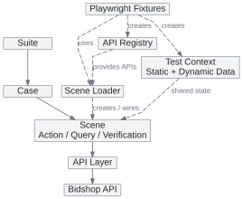
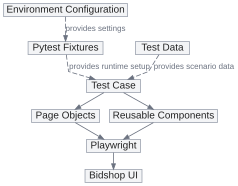

# Bidshop SDET Technical Assessment

This repository contains API and UI automated tests for the Bidshop application.

The solution focuses on a small number of representative tests, with emphasis on test design, maintainability, and clear separation of responsibilities rather than maximising test coverage.

## Frameworks

### API Testing — Playwright + TypeScript

I chose Playwright with TypeScript for API testing because the Bidshop backend is also written in TypeScript and runs on Node.js. Using the same technology stack makes the tests easier for developers to understand and contribute to, while keeping the tooling consistent with the application.

The API framework uses a layered design:



- **API layer** encapsulates HTTP endpoints and request/response contracts.
- **Scenes** represent reusable business actions, queries, and verification steps. A Scene can use one or multiple API domains.
- **Cases** compose Scenes into business test flows and bind their own test data.
- **Suites** group Cases for execution.
- **Context** manages static test data and runtime state within each test.
- **Test data** is separated from test logic and organised around the business scenarios that use it.
- **Configuration** manages environment-specific settings and shared business rules, such as the API base URL and NZ GST rate.
- **Fixtures** handle dependency wiring and test lifecycle.

The main API flow covers the core purchase flow from user registration and product selection through cart, order placement, stock validation, and persisted order verification.

Playwright's test runner provides execution, test isolation, and HTML reporting.

### UI Testing — Playwright + Python

I chose Playwright with Python for UI testing because browser-level tests are less coupled to the frontend implementation language, and Python allows me to build and maintain the UI automation efficiently.

The UI framework intentionally uses a lightweight Page Object design:



- **Page Objects** encapsulate page-specific locators and browser interactions.
- **Components** encapsulate reusable UI elements shared across pages.
- **Cases** describe user-visible test scenarios and contain the business assertions using Playwright's `expect`.
- **Test data** is externalised into JSON files and organised around the test scenarios that own it.
- **Configuration** is externalised from the tests and supports environment-specific settings such as the application base URL and default Playwright timeout.
- **Pytest fixtures** provide shared runtime configuration and test lifecycle support.

The UI automation covers user registration and an end-to-end purchase flow from product selection through cart and checkout to order confirmation.

I intentionally kept the UI framework simpler than the API framework. API tests frequently compose multiple service interactions into business workflows, while UI tests are primarily concerned with user-visible behaviour and page interactions. Page Objects and reusable Components provide sufficient abstraction for the current UI scope without introducing unnecessary layers.

## Install and Run

The Bidshop backend and frontend should be running before executing the tests.

### API Tests

Install dependencies:

```bash
cd api-tests
npm install
```

Run the API tests:

```bash
npx playwright test
```

The default API environment is `local`. A different environment can be selected using `TEST_ENV`:

```bash
TEST_ENV=local npx playwright test
```

The API base URL can also be overridden using `API_BASE_URL`.

Open the HTML report:

```bash
npx playwright show-report
```

### UI Tests

Create and activate a Python virtual environment:

```bash
cd ui-tests
python3 -m venv .venv
source .venv/bin/activate
```

Install dependencies:

```bash
pip install -r requirements.txt
playwright install chromium
```

Run the UI tests using the default local environment:

```bash
pytest
```

The default environment is `local`, with its configuration stored in:

```text
config/local.json
```

The environment can also be selected explicitly:

```bash
pytest --env=local
```

## Trade-offs and Future Improvements

### Shared Backend State and Parallel Execution

The Bidshop backend stores data in shared in-memory state. Tests that modify the same product can therefore interfere with each other's stock validation when executed concurrently.

The API framework itself supports Playwright parallel execution, but the current application does not provide isolated test data per worker. The state-changing purchase cases are therefore grouped and executed serially to avoid cross-test interference.

In a larger test environment, I would introduce isolated test data per worker, controlled test-data setup and cleanup, or independent backend instances before enabling parallel execution for state-changing scenarios.

### CI Integration

Both test projects currently run locally.

A next step would be to integrate them into CI, including automated execution, test reports, and failure artifacts such as screenshots and traces for UI failures.

### Known GST Issue

During testing, I identified a discrepancy between the documented business rule and the backend implementation.

The API documentation describes GST as **15%**, while the current backend implementation calculates cart GST at **12.5%**.

I kept the expected business rule at 15% rather than changing the test configuration to match the current implementation. The discrepancy is documented as a known application issue, while the strict GST assertion is excluded from the main passing workflow.
